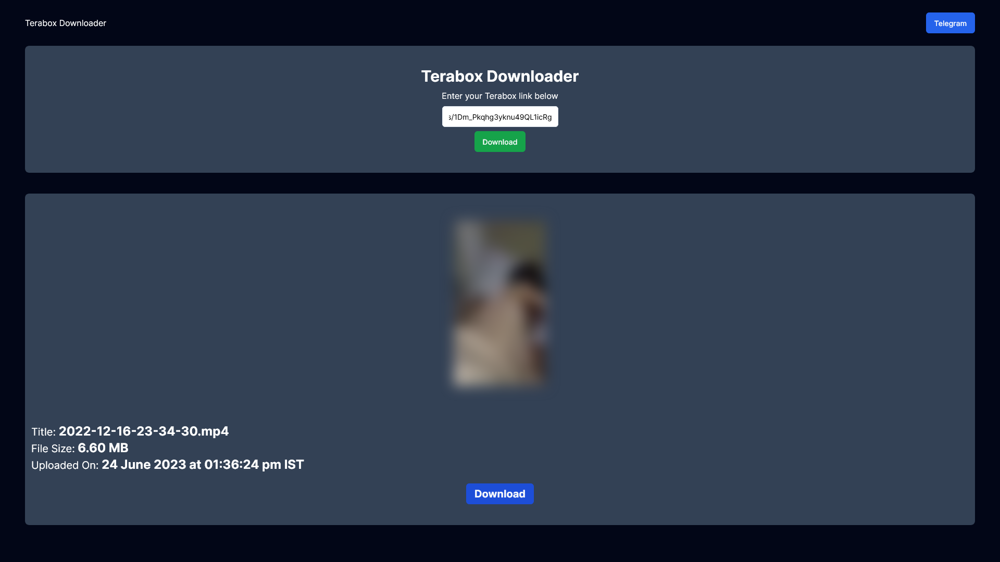

<h1 align="center" id="title">Terabox Downloader</h1>


<h2>Demo</h2>


<h2>🛠️ Installation Steps:</h2>

<p>1. <a href="https://nodejs.org/en/download/current">Download latest version of nodejs</a></p>
<p>2. <a href="https://github.com/r0ld3x/terabox-app/archive/refs/heads/main.zip">Download this repo</a></p>

<p>3. Unzip and open terminal in that folder</p>

<p>4. Download requirement's</p>

```
npm i
```

<p>5. Rename .env.example to .env and fill it</p>

```bash
COOKIE="PANWEB=1; csrfToken=; lang=en; TSID=; __bid_n=; _ga=; __stripe_mid=; ndus=; browserid==; ndut_fmt=; _ga_06ZNKL8C2E="
# COOKIE FOR AUTHENTICATION (get from chrome dev tools), Dont use current one


```

### Get terabox cookie:

1. Login in terabox with premium account
2. Open any terabox link and watch the video below

https://github.com/r0ld3x/terabox-downloader-bot/assets/77254818/1b68e6ae-715f-4778-845e-4b696762ea93

<p>6. Run the development server</p>

```
npm run dev
```

<p>7. Open <a href="http://localhost:3000">http://localhost:3000</a> with your browser to see the result.</p>

<h2>🍰 Guidelines:</h2>

Use at own risk. I am not responsible for break of any Terms and conditions of any companies and businesses.

## Learn More

To learn more about Next.js, take a look at the following resources:

- [Next.js Documentation](https://nextjs.org/docs) - learn about Next.js features and API.
- [Learn Next.js](https://nextjs.org/learn) - an interactive Next.js tutorial.

You can check out [the Next.js GitHub repository](https://github.com/vercel/next.js/) - your feedback and contributions are welcome!

## Deploy on Vercel

The easiest way to deploy your Next.js app is to use the [Vercel Platform](https://vercel.com/new?utm_medium=default-template&filter=next.js&utm_source=create-next-app&utm_campaign=create-next-app-readme) from the creators of Next.js.

Check out our [Next.js deployment documentation](https://nextjs.org/docs/deployment) for more details.
